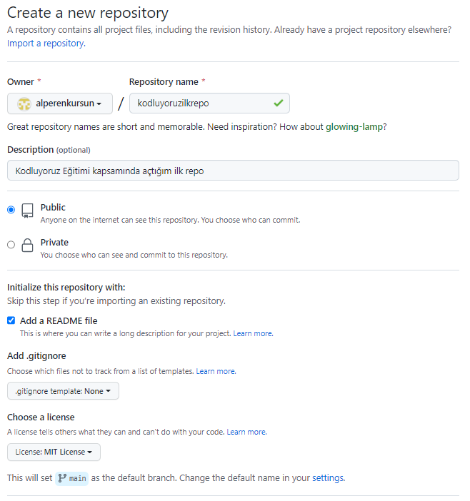

# Kodluyoruz Ilk Repo

Bu repo [Kodluyoruz](https://kodluyoruz.org/tr/kodluyoruz/) Front-End Eğitiminde oluşturduğumuz ilk repo. İçerisinde bir adet README dosyası, bir adet de index.html barındırıyor.



## Installation

Öncelikle projeyi clonelayın. (Buraya sizin reponuzdan aldığınız link gelecek)

```GIT
git clone https://github.com/alperenkursun/kodluyoruzilkrepo.git
 ```

 ## Usage

 Projeyi cloneladıktan sonra Visual Studio Code programında açınız.

 Linux için:

 ```LINUX
 cd kodluyoruzilkrepo
 code .
 ```

## Contributing

Pull requestler kabul edilir. Büyük değişiklikler için,lütfen önce neyi değiştirmek istediğinizi tartışmak için konu açınız.

## License

[MIT]()

## Link

[Patika](https://app.patika.dev/alpk)

